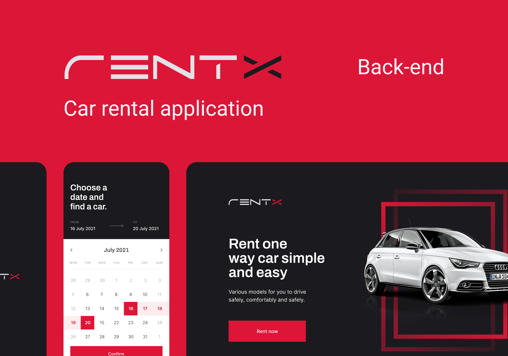

<h1 align="center">
  
</h1>

  <a href="#-projeto">Projeto</a>&nbsp;&nbsp;&nbsp;|&nbsp;&nbsp;&nbsp;
  <a href="#-tecnologias">Tecnologias</a>&nbsp;&nbsp;&nbsp;|&nbsp;&nbsp;&nbsp;
  <a href="#-como-executar">Como executar</a>&nbsp;&nbsp;&nbsp;|&nbsp;&nbsp;&nbsp;
  <a href="#-licença">Licença</a>

 

  

## 💻 Projeto

RentX é uma API de locação de carros que utiliza Express, Typescript, TypeORM e Swagger. Desenvolvida com uma arquitetura bem definida e altamente modular, busca proporcionar uma experiência de locação de veículos eficiente e confiável. Com uma documentação clara fornecida pelo Swagger, RentX simplifica o processo de locação para os usuários e desenvolvedores.

## ✨ Tecnologias

Esse projeto foi desenvolvido com as seguintes tecnologias:

- [TypeScript](https://www.typescriptlang.org/)
- [Express](https://expressjs.com/)
- [Multer](https://github.com/expressjs/multer)
- [TypeORM](https://typeorm.io/#/)
- [JSON Web Token](https://jwt.io/)
- [PostgreSQL](https://www.postgresql.org/)
- [Jest](https://jestjs.io/)
- [SuperTest](https://github.com/visionmedia/supertest)

## 🚀 Como executar

- Clone o repositório
- Instale as dependências com `npm i`, `yarn` ou `pnpm i`
- Crie uma cópia do `.env.example` para o `.env` com `cp .env.example .env` e preencha com as suas variáveis de ambiente
- Inicie todos os serviços e a aplicação com o Docker compose utilizando `docker-compose up -d`
- Rode as migrations do banco de dados com `npx typeorm migration:run`m `yarn typeorm migration:run` ou `pnpx typeorm migration:run`
- Execute as seeds para população do banco de dados com `npm run seed:admin`, `yarn seed:admin` ou `pnpm run seed:admin`
- Inicie a aplicação com `npm run dev`, `yarn dev` ou `pnpm run dev`

Agora você pode acessar as rotas em [`localhost:3333`](http://localhost:3333) utilizando o [Postman](https://www.postman.com/) ou [Insomnia](https://insomnia.rest/), a documentação das rotas está disponível em [`localhost:3333/docs`](http://localhost:3333/docs).

## 📄 Licença

Esse projeto está sob a licença MIT. Veja o arquivo [LICENSE](LICENSE) para mais detalhes.

---

Feito com ♥ por Erick Nathan durante o programa de formação [Ignite](https://www.rocketseat.com.br/ignite) promovido pela [Rocketseat](https://www.rocketseat.com.br)
